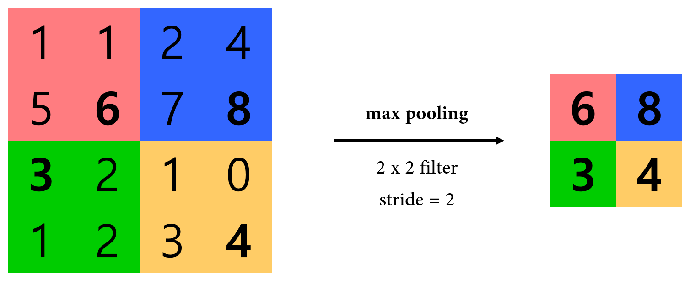
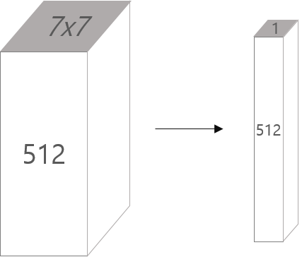

## Convolution Layer
The convolution layer is a basic building block of CNN. Convolution layer has small filters that are parameters. It takes input image, convolves that image with each filters (which called **activation map**), stack them, and finally makes new output image.

### Example
Let's deal with **CIFAR-10** image as example, which we used in assignment 1. Each CIFAR-10 image has **32 x 32** width and height, and **3** channels in depth for representing RGB. Totally it is a **32 x 32 x 3** tensor. And assume that we have **5 filters** with **5 x 5** size.
The depth of filter usually equals to input image's depth. So we have **5 x 5 x 3** dimension filter in this case, then we can take **dot product** between partial image and filter. Additional **bias** is taken care to compute each pixel in activation map. Finally we will get **28 x 28 x 1** activation map for each filter. Repeat this process for each filter, stack all the activation map, and we finally get output image. 


## Convolutional Neural Network
**Convolutional neural network** composed of many **convolution layers**, interbed with **activation function** (e.g ReLU) layer. Additional layer called **pooling layer** will be discussed. As input data pass through layers, it transformed from **low-level** feature to **high-level** feature. In image classification problem, after extracting high-level feature from input image, **trainable classifier** is attached to final layer. That's it.

### Hyperparameter
Almost conventional framework (e.g. Torch, Caffe, Lasagne) shares same hyperparameter configuration for CNN. There are totally four hyperparameters to define exact convolution computation.

**# of filters.** A number of filters equals to output tensor's depth. Therefore, it will be same with next convolution layer's filter depth.
**Filter size.** Usually, filter is a square and has odd size. **3 x 3** or **5 x 5** is usual. A combination of (filter size, stride) should match input image's size.
**Stride.** In former example, we assumed that filter convolves entire input image pixel by pixel. This equals to assuming stride is one. In general, stride means step size for convolution of a filter. In usual, it equals to `1`.
**Zero-padding.** If we don't use zero-padding, size of image decreases (F-1) for each layer. Nowadays number of layers in deep neural net is ~ 100 order, so (F-1) decrease in each layer should be a problem. So usually we adapt `(F-1)/2` zero-padding to maintain size of image.

### Number of parameters in each layer
It depends on input's `depth`, `filter size`, and `# of filters`. For example, considering input image with RGB channel and ten 5 x 5 filters.
> \# of parameters = (filter size x depth + bias) x # of filters = (5 x 5 x 3 + 1) x 10 = 760

### Relation between input/output size
It depends on `filter size`(=F), `stride`(=S), `# of filters`(=K). If a size of input is `W1` x `H1` x `D1`, then size of output will be,
* `W2` = (`W1` - `F` + `2P`) / `S` + 1
* `H2` = (`H1` - `F` + `2P`) / `S` + 1
* `D2` = `K`

### Some lessons
Only adjacent region in input image collaborate in convolution. It can be understood as **local connectivity** in human brain. For each activation map, small regions in input image share same parameters of a filter. Therefore `5x5` filter corresponds to `5x5` **receptive field** for each neuron. Each small region is a test data, then whole image is a **mini-batch**. Each filter act like single neuron in next layer. For example, some filter act like edge detector neuron, which activate with the edge in fixed orientation.

## Pooling Layer
Next to convolution layer, pooling layer makes the representations smaller and more manageable. It erase exact positional information of some feature(*where green square exists*), but keep the strength of that feature(*green square exists in those region*).
### Example: max pooling
In practice, **max pooling** is most successful in conventional CNN.

### Relation between input/output size
It depends on **filter size**(=F), **stride**(=S). If a size of input is `W1` x `H1` x `D1`, then size of output will be below. (2, 2) or (3, 2) are most common settings for filter size and stride.
* `W2` = (`W1` - `F`) / `S` + 1
* `H2` = (`H1` - `F`) / `S` + 1
* `D2` = `D1`

## Fully Connected Layer
It contains neurons that connect to the entire input volume, as in ordinary neural networks. Fully connected layer usually places in last part of CNN after some convolution layers, and pooling layers. In many case, convolution layer is set to keep input dimension(controlled by hyperparameters), and pooling layer halves dimension in each axis(`2x2` filter, stride=2). 
### Example
Let's consider `32x32` input images with **RGB channel**, then input volume size is `32x32x3`, and convolution layers with **10 filters**. Output dimension will be same with `32x32x10`. And assume that there are totally three pooling layers in CNN. Before fully connected layer, dimension will reduce to `4x4x10`. 
Final input to fully connected layer, `4x4x10` tensor, is flatten to `160x1` column, then pass to fully conntected classifier. Detail in classifier is similar with classifier in normal neural network.
# Case Study
## LeNet-5 (1998)
CONV - POOL - CONV - POOL - CONV - FC
## AlexNet (2012, ILSVRC winner)
CONV - POOL - NORM - CONV - POOL - NORM - CONV - CONV - CONV - POOL - FC - FC - FC
* **ReLU** was used primally
* **NORM** layer was used, which does not exist in now. It doesn't have effective improvement.
* **Heavy data augmentation technique** was used. Original data was rotated, jiggled, or moreover to get additional datas.
* **Dropout** with ratio 0.5 was used to final FC layer.
* **Batch** size is 128.
* **SGD** update with momentum was used with coefficient 0.9
* **10^-2** is initial learning rate, reduced by 10 manually when validation accuracy plateaus.
* **L2 weight decay** with 5x10^-4 was used.
* **Ensemble**(7 CNN) enhances test error from 18.2% to 15.4%

### Top 5 Error
Performance standard in ILSVRC is top 5 error. For each image, if top 5 results from classifier contains correct answer, then it considered as correct.

## ZFNet (2013, ILSVRC winner)
ZFNet is variation of AlexNet. CONV1 was changed from `11x11` filter with stride=4 to `7x7` filter with stride=4. And number of filters in CONV3, 4, 5 was changed from 384, 384, 256 to 512, 1024, 512. ZFNet reduced test error from 15.4% to **11.2%**.
## VGGNet (2014)
VGGNet fixes hyperparameter for CONV layer and POOL layer. They found out that most memory is used in early CONV layers, and most parameters are used in late FC layers. So average each cross section to reduce number of parameters to FC layer. They reduce error rate 11.2% to **7.3%**.
* **CONV** layer use `3x3 filter` with stride=1, zero-padding=1
* **POOL** layer use max pooling, with `2x2` filter and stride=2


## GoogLeNet (2014, ILSVRC winner)
They introduce concept of `inception module`, which makes architecture funky. Another big change is eliminating entire FC layers. Number of parameters is only 5 million. Compare with AlexNet, it uses 12 times smaller parameters, 2 times bigger computation, and reducing error rate from 15.4% to **6.7%**.
### VGGNet vs GoogLeNet
Even though winner in ILSVRC 2014 is GoogLeNet, people are more interested in VGGNet for their simplicity in architecture.
## ResNet (2015, ILSVRC winner)
ResNet hugely increases **number of layers** in CNN architecture. Compare with 8 layers in AlexNet and ZFNet, 19 layers in VGGNet, and 22 layers in GoogLeNet, ResNet uses 152 layers.

They found out that 20 layer architecture show less **"training error"** than 56 layer architecture in CIFAR-10 data set. Therefore, they realized that current optimization technique has limitation in complex architecutre. So they introduce concepts of `shortcut` and `residual function` to get common-sense result: complex network achieves lower training error.

Because of complexity, it takes 2-3 weeks of training on 8 GPU machine. But ResNet even faster than VGGNet in run time. It can be said that ResNet focused more on layer depth, than layer width.
### Features
* **Batch normalization** after every CONV layers.
* **Xavier/2 initialization** used which introduced by same author, Kaiming He.
* **SGD** with momentum (coefficient=0.9)
* Learning rate starts with **0.1**, then divided by 10 when validation error plateaus. Its start value is pretty high supported by batch normalization.
* **Mini-batch** size is **256**.
* **Weight decay** of 10^-5
* **No dropout**.
 
## Alpha-Go
Alpha-Go use few networks according to its usage. In policy netwrok, they extract 48 kinds of feature from `19x19` Go board, , then make `19x19x48` input volume. They use one `1x1` filter in last CONV layer to make `19x19x1` volume. It means probability map of promising moves in Go board.
# Summary
* ConvNet stack CONV, POOL, FC layers.
* Trend towards smaller filter & deeper architecture.
* Trend towards getting rid of POOL / FC layer (just use CONV)
* Typical architecutre look likes below. In usual, N < 5, M is very high, 0 <= K <= 2. But GoogLeNet and ResNet try to shift paradigm.
```
[(CONV - RELU) * N - POOL] * M - (FC - RELU) * K, SOFTMAX
```