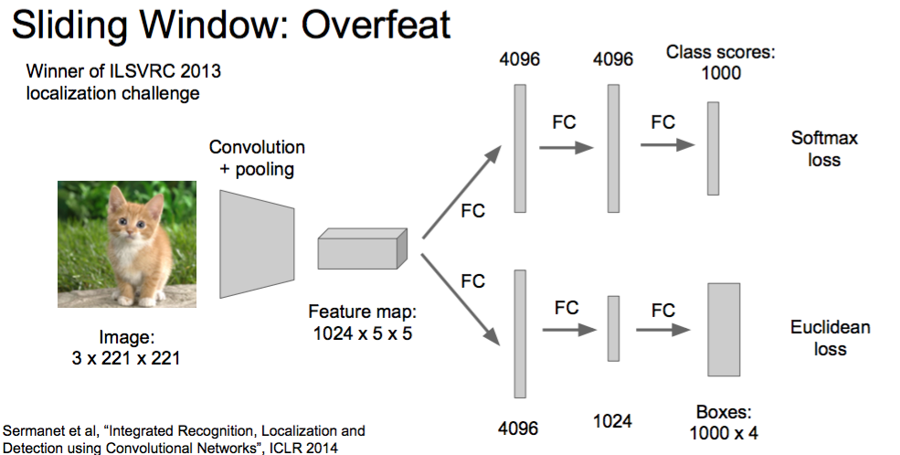

#### single object
* classification
* classification + localization

#### multiple object
* object detection
* ~~instance segmentation~~ (얘는 다루지 않음!)

## Localization as Regression
* Box Coordinate (4 numbers) 를 네트워크의 output 으로 한다. 
* Loss = output 과 correct output 사이의 L2 distance

### step 1: Train (or download) a classification model
트레이닝 된 상태로 받아오나?
### step 2: Attach new fully connected "regression head" to the network
~~어디에 붙이지?~~
* After conv layers : Overfeat, VGG
* After last FC layer(=score function 직전) : DeepPose, R-CNN

어쨌든 regression head 도 FC layer + classifier 로 구성된다.

* classification head : C numbers
* class agnostic : 4 numbers (one box)
* class specific : C x 4 numbers (one box per class)

만약 K 개의 object 를 localization 하고 싶다면, regression head 가 K x 4 numbers 를 내뱉는다고 한다. Human Pose Estimation 이 그 예이다. Human Pose 를 K 개의 직사각형으로 나눠서 각각을 joint 로 표현하기에 좋다.

regression 결과, number 가 이미지 밖으로 빠져나갈 수도 있음에 유의하자~

### step 3: Train the regression head only with SGD and L2 loss
regression head 앞부분도 트레이닝 시키나?
### step 4: At test time, use both heads
그렇겠지
 
## Sliding Window
ILSVRC 우승을 위해서는, 위의 일반론적인 방법외에 특별한 것들이 더 필요했다! 하지만 내용이 쉽다! (학생들에게 프로젝트에 사용해볼 수 있을거라 안내함)
* Run classification + regression network at **multiple locations** on a highresolution image
* Convert fully-connected layers into convolutional layers for efficient computation
* Combine classifier and regressor predictions **across all scales** for final prediction

### Overfeat (2013 winner)

(왜 그런 상황이 발생하는지는 모르겠는데.... classification 이랑 detection 이랑 data set 이 다른가?) 네트워크 input 에 비해서 큰 이미지를 detect 해야하는 경우를 소개했다. 예를 들어 네트워크 input 은 **3 x 221 x 221** 인데, data 가 **3 x 257 x 257** 인 경우다.

이 경우 네트워크 input 크기의 sub-image 들을 생각해볼 수 있다. 간단하게 생각해보면, data 의 좌상단/우상단/좌하단/우하단 네 귀퉁이에 input 크기의 직사각형을 생각하는 것이다. 각각의 sub-image 에 대해서 regression head 랑 classification head 를 돌려서 box coordinate 랑 score 를 얻을 수 있다. 여러쌍의 결과를 **"greedy merge boxes and scores"** 해서 하나의 결과를 얻을 수 있다. [detail in paper](https://arxiv.org/pdf/1312.6229v4.pdf) 라고 한다.

(논문을 좀 읽다보니, 단순히 네 귀퉁이를 보는게 아닌것 같다. 수업 내용을 잘못 이해한듯)

FC layer 대신에 CONV layer 를 사용하면 더 effective 한 계산이 가능하다. training time 과 test time 의 이미지 크기가 달라지는 설명이 있는데, 무슨 얘기인지 잘 모르겠다. 논문을 정독하고 제대로 파볼까 싶다가도, 2014년도 얘기니까 굳이 봐야하나 싶기도 하고...

### Record
**AlexNet (2012):** No publication, **34.2%**
**Overfeat (2013):** Multi scale convolutional regression with box merging, **29.9%**
**VGG (2014):** (이 부분은 GoogLeNet 을 이겼군) Overfeat 과 동일한데, scale/location 개수는 더 적고, simpler method 이다. 다만 deeper network 이기 때문에 성능 좋아짐!, **25.3%**
**ResNet (2015):** RPN 이라는 다른 localization method 를 사용하고, much deeper feature!, **9%** (ㅎㄷㄷ)

VGGNet 은 처음까지 back-prop 했고, 어떤 네트워크는 regression head 만 back-prop 한 경우도 있다. head 별로 아예 네트워크를 분리한 경우도 있었다.

## Object Detection: Detection as Classification
object detection 을 regression 으로 접근하려면 난감하다. 몇개의 object 가 있을지 모르므로, output 이 가변적이기 때문이다. object 개수 x 4 numbers 를 output 으로 뽑아내야 box coordinate 를 구성할 수 있고, 그래야 score 를 뽑아낼 수 있다.

그래서 regression 대신 classification 으로 접근한다! input image 의 partial region 을 보면서 classification 을 진행한다. 기본적으로 모든 window size 에 대해서 해본다. 각각의 sub-image 에 대해서 마치 그게 input data 인 것처럼 네트워크를 통과시키면 각 class 에 대한 score 를 얻을 수 있다. (이걸 어느 threshold 값 기준으로 넘으면, 해당 object 가 detect 되는걸까?)

**problem:** Need to test many positions and scales.
**solution:** If your classifier is fast enough, just do it. 

사실 detection 은 CV 의 고전적인 문제이다. 예를 들어 pedestrian detection 의 경우 **HoG** feature 가 효과적이었다. HoG = **Histogram of Oriented Gradients** [논문 링크, 2005년꺼네?](https://lear.inrialpes.fr/people/triggs/pubs/Dalal-cvpr05.pdf)

이미지를 여러 scale 로 준비하고, 각각의 scale image 마다도 window 로 sub image 를 순회하면서 linear classifier 를 때려서 **feature pyramid** 를 획득한다. 거기에 **non-maxima suppression** 이라는 테크닉이 가미된다.

이를 기반으로 DPM(Deformable Parts Model) 을 생성한다. 알고리즘을 좋아한다면 흥미로울 거라고 하네. [논문 링크, 2010년꺼네?](https://people.eecs.berkeley.edu/~rbg/papers/Object-Detection-with-Discriminatively-Trained-Part-Based-Models--Felzenszwalb-Girshick-McAllester-Ramanan.pdf)

**Problem:** Need to test many positions and scales, and use a computationally demanding classifier (CNN)
**Solution:** Only look at a **tiny subset** of possible positions

그래서 region proposal 의 개념이 나온다.

## Region Proposals
* Find "blobby" image regions that are likely to contain objects
* "Class-agnostic" object detector
* Look for “blob-like” regions

구체적으로는 여러 기법이 가능한데, 그 중 **selective search** 가 좀 대표적인가보다.
(Bottom-up segmentation, merging regions at multiple scales)
이미지의 비슷한 segment 들을 merge 시키면서 scale 을 변화 시키면서, 매 scale 에서 이미지 -> boxes 로 변환한다. 디테일은 알 필요 없다고 한다.

그 외에도 choice 들은 많이 있다. 필요하다면, EdgeBoxes 를 생각해보라고 한다. 표를 보니, 속도/성능 모두 상위권이다.

## R-CNN
[논문 링크, 얘는 2014년이네?](https://arxiv.org/pdf/1311.2524v5.pdf)
= 모든 것을 putting it together

* input image 에 proposal method 를 적용해서 대략 2000개 정도의 RoI(Region of Interest) 를 뽑아낸다.
* warped image regions = 크기가 동일해지네? CNN 에 집어넣기 위함인듯?
* Forward each region through ConvNet
* Apply bounding-box regressions / Classify regions with SVMs

### Step 1: Train (or download) a classification model for ImageNet (AlexNet)
### Step 2: Fine-tune model for detection
- Instead of 1000 ImageNet classes, want 20 object classes + background
- Throw away final fully-connected layer, reinitialize from scratch = 마지막 FC layer 의 모든 parameter 를 weight initialization 시킨다는 얘기인듯!
- Keep training model using positive / negative regions from detection images

(여기서 positive / negtive region 이 뭔지 모르겠다~~~)
### Step 3: Extract features
- Extract region proposals for all images
- For each region: warp to CNN input size, run forward through CNN, save pool5 features to disk
- Have a big hard drive: features are ~200GB for PASCAL dataset!

### Step 4: Train one binary SVM per class to classify region features
- Step 3 에서 training image region 에 대한 pool5 feature 들을 저장해놨었다. 그 feature 들을 input 으로 해서 binary SVM 을 train 한다.

(binary SVM 이 정확히 어떤 느낌이었더라?)

### Step 5 bbox regression
- For each class, train a linear regression model to map from cached features to offsets to GT boxes to make up for “slightly wrong” proposals

offset 을 4 numbers 로 regression 한다. (0, 0, 0, 0) 이면 제일 좋고, 조금 tilt 된거면 각 원소에 값이 생긴다.

(흠... data set 의 구성과 대회 조건에 대해서 좀 알아야겠다. Step 4 에서 binary classification 하는거나 Step 5 에서 4 numbers 로 regression 할때 training data 들이 무엇인지 이해가 안된다)
(아마 사진에 여러 object 들을 각각 localization 해야할 것이다)

61 페이지까지 봤는데..... 힘들군.

