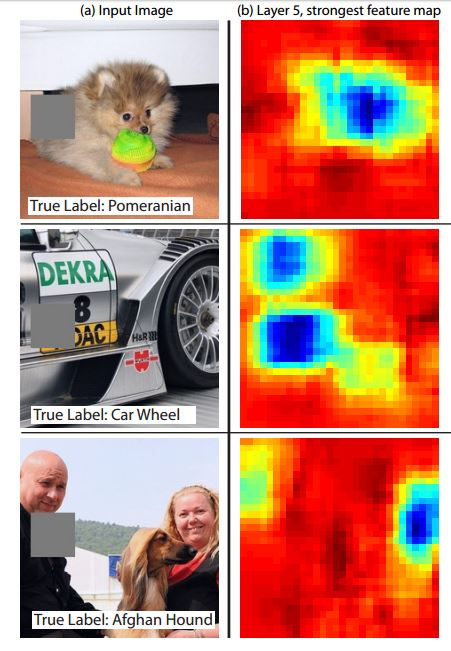
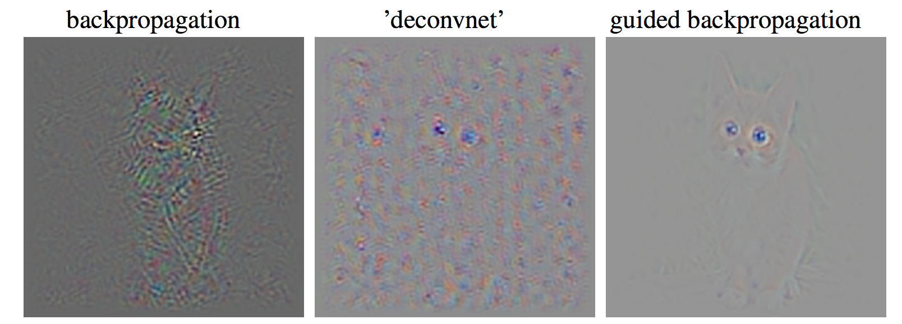
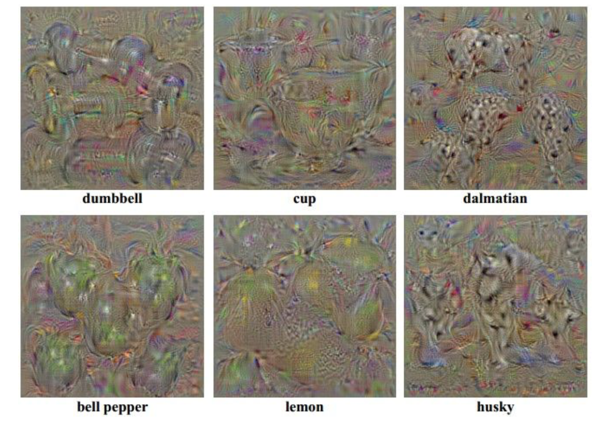
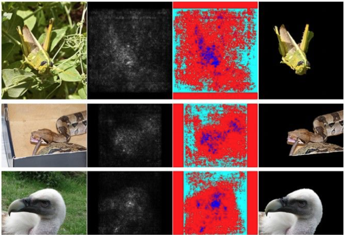
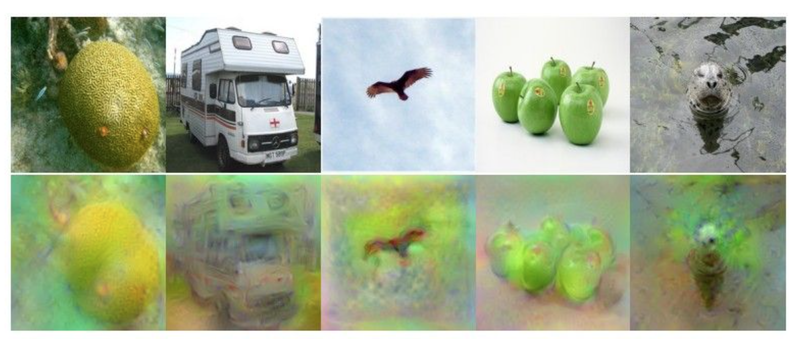
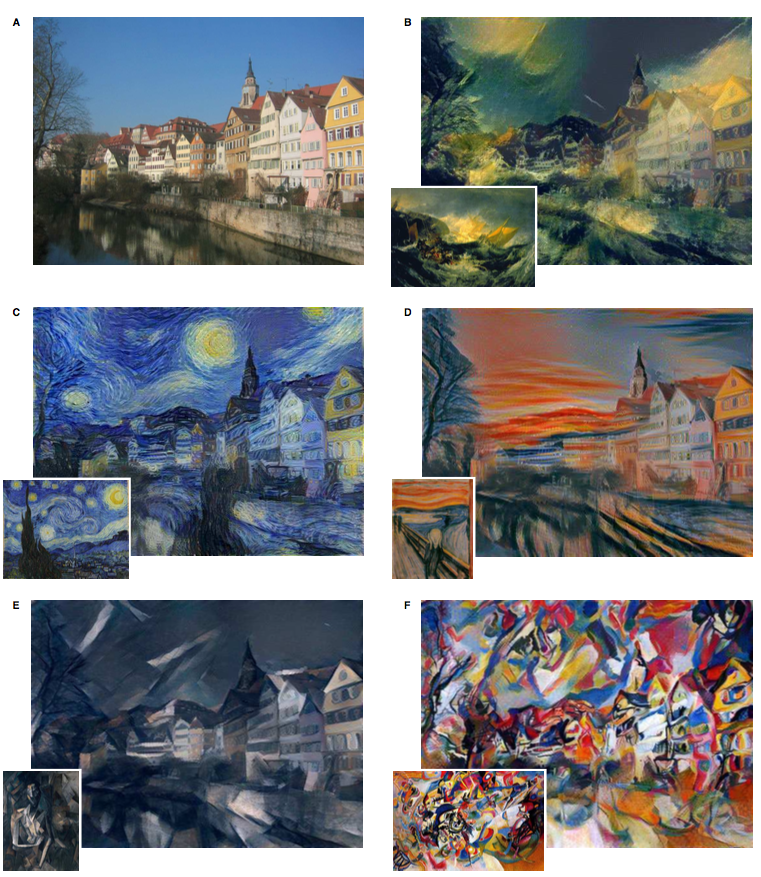

# Understanding ConvNet

## Visualize the filters/kernels
The parameters of each CONV layer are composed of multiple 2D filters. So we can visualize each 2D filter as a image. But only filters in first CONV layer can be visualized meaningfully. That's because only input of first CONV layer(first filter) has a graphical meaning in 2D space.

## Visualize representation
In every CNN, their last layer is a classifier. And we call input vector of this layer **"code"**. For example, code of VGGNet has 4096 dimension.

### t-SNE visualization
To visualize (high-dimensional) code, we embed code to two dimensional space, while pairwise distances are conserved. So similar codes end up in similar places, while dissimilar codes end up wherever.

 

## Occlusion Experiments
Occlusion experiments is for understanding which part of image contributes to correct label score. While sliding a small patch occlusion over the given image, compute CNN score for true label. Then we can draw two dimensional heat map, (patch x-pos, patch y-pos) to score. Lower score means that patch contributes classifier a lot, and higher score means that patch disturb classifier a lot.

## Deconv approaches
Deconvolution finds **gradient of input image** for arbitrary neurons (neuron is an activation map of filter) in network. It is composed of single forward/backward propagation, therefore computational cost is effective.

* Select **target neuron**, feed forward image into network up to the layer containing that neuron and get activations.
* Set gradients of those layer as **one-hot vector** (one for target neuron, zero for the others)
* Backprop the gradients through the network up to input image and get gradients of the image.

In the backward pass, if we use pure backpropagation, there will be negative passes and positive passes at the same time, and we will not get a clean gradient image. However, if we use **guided backpropagation**, we ignore all negative passes and get a clean gradient image.

## Optimization to Image
### Find images that maximize some class score
Q: can we find an image that maximizes some class score?

1. feed in zeros.
2. set the gradient of the scores vector to be [0,0,....1,....,0], then backprop to image.
3. do a small “image update”
4. forward the image through the network. 
5. go back to 2.

In the third step, not only the analytic gradient should be added, but the regularization term should also be included. Because if a regularization term does not exist, then a meaningless image may appear instead of a natural image.

### Visualize the Data gradient
Once we have a gradient of the image, we can visualize data gradient of image by taking absolute value and maxing over channels at each pixel. And we can get segmentation of class in image by grabcut. 

 
  
We can in fact do this for arbitrary neurons along the ConvNet.

### Reconstruction of Image
Q: Given a CNN code, is it possible to reconstruct the original image?  

* We can reconstruct the original image by finding a image which code is similar to a given code and looks natural (image prior regularization).   

Reconstructions from the representation after last pooling layer (immediately before the first Fully Connected layer).

### Deep Dream
DeepDream modifies the image in a way that “boosts” all activations, at any layer. After setting the gradients value of the selected neuron to activation of the neuron, backpropagation is started from the corresponding layer. Update the image using the gradients value of the image obtained by backpropagation. Repeat this process. This creates a feedback loop: e.g. any slightly detected dog face will be made more and more dog like over time.

### Neural Style
Transfer the style from one image onto another. 
 

**step 1**  
Extract **content targets** (ConvNet activations of all layers for the given content image). 

**step 2**  
Extract **style targets** (Gram matrices of ConvNet activations of all layers for the given style image).

First, the style target image is inserted into CNN to acquire the activation of all layers. Then, use this activation to get the **fiber**. For example, suppose that the dimension of the tensor in which the activation maps are stacked is `224 x 224 x 64`. So each `1 x 1 x 64` is called **fiber**. So there are `224 x 224` **fibers** in total. Now, for all pairs of fibers, calculate `64 x 64` matrix by outer product and add the results to produce the final `64 x 64` tensor. This is called the **Gram Matrix** (by paper) or **Covariance** (the concept of statistics).  

The simplest way to do this is to do the calculations `(V.T.dot(V))` after create a matrix `(= V)` with row 224x224 and column 64 by connecting all the fibers together.

However, the **Gram Matrix** is not the most important thing that makes this possible. In fact, you can get similar results using the variants and mean of the activations instead of **Gram Matrix**.
  
**step 3**  
Starting with a zero image, the content is optimized to be the same as the content target image, and the style is optimized to be the same as the style target image. In this optimization, we use only two images, so we can use **L-BFGS** (2nd order optimization) because all parameters fit in memory.

## Can We Make ConvNet be Fool?
We can pose an optimization over the input image to maximize any class score.  
Q: Can we use this to "fool" ConvNets?  
A: Yeah!

So, for example, you can update any input image to maximize the ostrich score of ConvNet's classifier. Our expectation is that this process will transform the image into an image close to ostrich. However, it was possible to make the ostrich score very high just by applying a distortion that is so difficult for people to feel the change. You can start the same task entirely with random noise. An image that looks like random noise in the human eye can be classified as a specific class with a confidence level of 99.6% or more. This have happened before ConvNet. For example, in the case of a HOG, the HOG features of images can be made almost identical, even though images are completely different for the human. These are called **adversarial examples**.

> primary cause of neural networks' vulnerability to adversarial perturbation is their **linear nature**.

**Linear nature** of the functions that were used in the forward pass. Images are super high dimensional objects, lots of pixels so there is a hundred and fifty thousand dimensional space. And the real images that we actually trained on are statistical structures and they are constrained to a tiny manifold of this space. ConvNet were very well on that tiny manifold where statistics of images are image-like. But the outsides of the manifold were kind of casting shadows of complete randomness and chaos because we haven't trained there. 
That is, after ConvNet is completed by searching for a very restrictive manifold in very high dimensional space, you will experience tremendous chaos in shadow that has not yet been searched (e.g. random noise).

Also, since the input dimesions are so large that even very small element-wise variations are present, the sum is so large that the results are very severe.

In particular, this is not a problem with Deep Learning, and has little to do with ConvNets specifically. Same issue would come up with Neural Nets in any other modalities. This is because all of them are based on linear nature, not learning the entire data manifold, but learning with low-level statistics.
